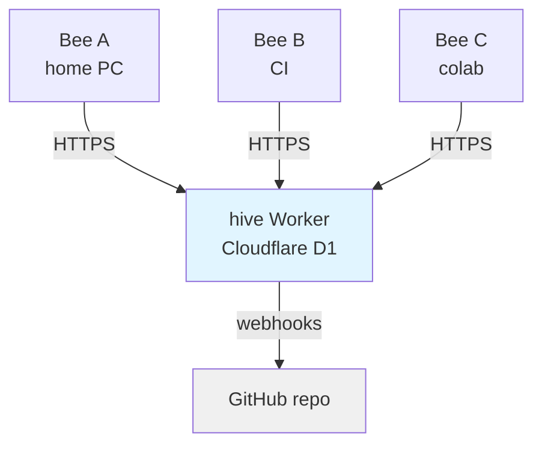

# Beehive
*So, do you like code?*

Distributed task coordination server for AI agents. Bees anywhere can claim tasks, work on git branches, submit PRs, and report results. The hive coordinates state via REST API + D1.

## Architecture



Tasks flow: `open` → `in_progress` → `pending_review` → `closed`

The PR is the trust boundary. Submissions are held until approved.

## Deployment

### Deploy the Hive (Cloudflare Worker)

```bash
cd worker
npm install
wrangler deploy
```

This creates the D1 database and deploys the REST API to Cloudflare.

### Bootstrap a Project

```bash
cd your-project
bh init --server https://hive.example.com --repo owner/your-project
# Returns admin key
```

Save the admin key — it can't be retrieved later.

## CLI Usage

### Setup

```bash
# Option 1: Use .env file (recommended)
cat > .env << EOF
BH_SERVER=https://hive.example.com
BH_KEY=bh_ak_...
EOF

# Option 2: Export manually
export BH_SERVER=https://hive.example.com
export BH_KEY=bh_ak_...
export BH_PROJECT=myproject  # Optional: defaults to directory name
```

### Bee Workflow

```bash
# Claim next task
bh next

# Work on branch, create PR
git checkout -b task/myproject-abc
# ... work ...
gh pr create --title "myproject-abc: Implement feature"

# Submit results
bh submit myproject-abc \
  --pr https://github.com/owner/repo/pull/42 \
  --summary "Implemented feature X" \
  --follow-up "Write tests:test:1"
```

### Admin Workflow

```bash
# List pending submissions
bh list --state pending_review

# Approve or reject
bh approve myproject-abc
# OR
bh reject myproject-abc --reason "Needs more tests"

# Key management
bh keys create --role bee --label "ci-runner"
bh keys list
bh keys revoke abc123...
```

### Bulk Operations

```bash
# Backup project
bh dump myproject > backup.json

# Restore or migrate
bh load myproject < backup.json
bh load myproject --replace < backup.json
```

## API Endpoints

See `docs/DESIGN.md` for full REST API specification.

Key endpoints:
- `POST /projects` — Bootstrap new project
- `POST /tasks/next` — Claim next task
- `POST /tasks/:id/submit` — Submit PR for review
- `POST /tasks/:id/approve` — Approve submission
- `POST /tasks/:id/reject` — Reject submission

## Development

```bash
# Build CLI
npm install
npm run build

# Run local server
bh serve --port 3847
```

## Environment Variables

- `BH_SERVER` — Hive URL (required)
- `BH_KEY` — API key (required)
- `BH_PROJECT` — Project name (optional, defaults to directory name)

## License

MIT
