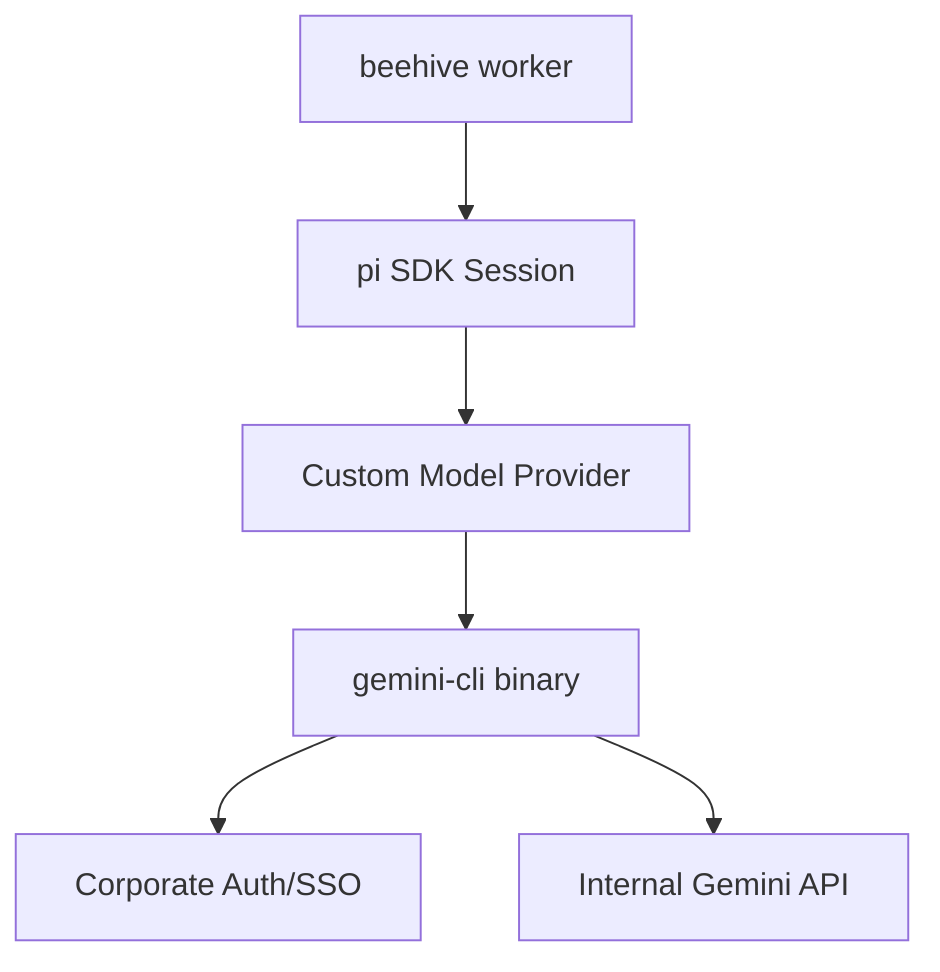

# Gemini CLI Integration Design

This document outlines the strategy for integrating a corporate `gemini-cli` binary as the underlying LLM provider for the `beehive` worker harness.

## Architecture Overview

Currently, `beehive` uses the `pi` SDK which communicates directly with model providers (Google, Anthropic) via HTTP. To use a local CLI, we introduce a **Custom Model Provider** that wraps the CLI as a subprocess.



## Implementation Strategy

### 1. The Model Interface
In the `pi` framework, we must implement the `Model` interface. This interface is responsible for taking the conversation history and returning an assistant response (text or tool calls).

```typescript
import { Model, ModelResponse, AgentMessage } from '@mariozechner/pi-coding-agent';

class GeminiCLIModel implements Model {
  readonly id = 'gemini-cli';
  readonly provider = 'corporate';

  async generate(
    messages: AgentMessage[],
    tools: Tool[],
    options: GenerateOptions
  ): Promise<ModelResponse> {
    // 1. Format messages for CLI
    // 2. Spawn gemini-cli subprocess
    // 3. Handle streaming stdout
    // 4. Parse response for text and tool calls
  }
}
```

### 2. Subprocess Management
The provider will use `child_process.spawn` to interact with the CLI.

- **Input**: The conversation history will be passed via `stdin` or CLI arguments (e.g., `--json-input`).
- **Output**: The CLI's `stdout` will be streamed. We will look for:
    - Text fragments (for real-time streaming to the `bh` console).
    - Structured tool calls (JSON blocks) at the end of the response.

### 3. Tool Calling (Function Calling)
The `bh worker` requires tool access to perform tasks. There are two paths depending on the CLI's capabilities:

- **Native Support**: If the `gemini-cli` supports `--tools`, we pass the `pi` tool definitions to it and map its output directly.
- **Prompt-Based**: If the CLI is text-only, we update the `systemPrompt` to instruct Gemini to output tool calls in a specific format (e.g., XML or JSON blocks), which our `Custom Model Provider` will parse before returning the response to the `pi` session.

## Integration Benefits

1. **Auth via SSO**: No API keys are stored in `backlog.json` or environment variables. The CLI uses your existing corporate login.
2. **Policy Compliance**: All traffic goes through the approved corporate proxy and logging layers provided by the CLI.
3. **Memory Persistence**: We can use the CLI's existing session management (if available) or rely on `beehive`'s `sessionId` logic to maintain context.

## Configuration in `beehive`

Once implemented, you would register the provider in `src/commands/worker.ts`:

```typescript
const cliModel = new GeminiCLIModel('/path/to/gemini-cli');
this.modelRegistry.registerCustomProvider('corporate', cliModel);
```

Then, you can update your agents (e.g., `agents/code.md`) to use it:

```yaml
---
name: code
model: corporate/gemini-cli
---
```

## Next Steps

1. **Verification**: Confirm if `gemini-cli` supports JSON input/output for easier parsing.
2. **Prototype**: Create a standalone script to verify `pi` tool call parsing with the CLI output.
3. **Integration**: Update `TaskManager` and `Worker` to support the custom provider registration.
