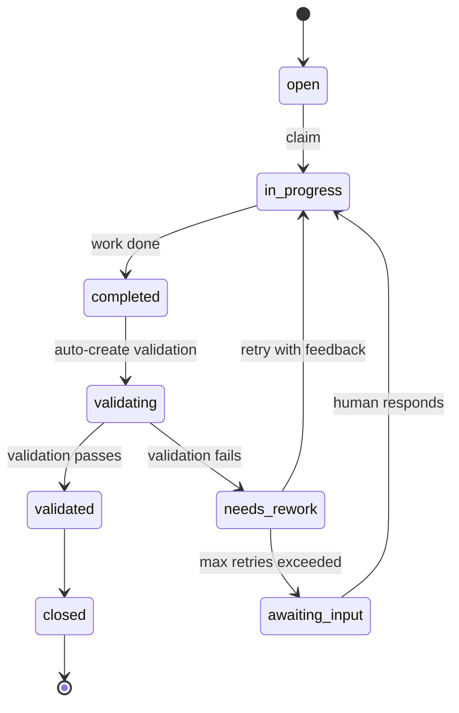
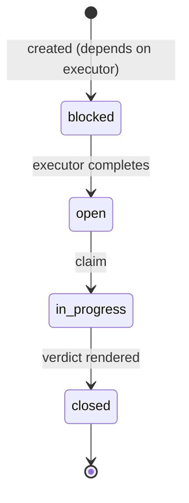

# Validation and Workflows Design

## Overview

This document describes tm's approach to validation, feedback loops, and workflow-based task lifecycle management. The design aims for **antifragility** and **self-healing** through structured feedback accumulation, while remaining simpler than Gas Town's agent proliferation or beads' type hierarchy.

## Design Principles

### 1. NDI (Nondeterministic Idempotence)

The system ensures reliable outcomes from unreliable LLMs through:
- **Validation as lifecycle step** (not separate infrastructure)
- **Feedback accumulation** (each retry has richer context)
- **Automatic escalation** (human gate after N failures)

### 2. Validation ≠ Review Infrastructure

Unlike Gas Town (Witness, Refinery, Deacon oversight agents), validation is **task metadata**:

```
Task → Execute → Validate → Pass/Retry/Escalate
```

Not separate long-lived validator agents. Just workflow-defined steps.

### 3. Multi-Model Validation

LLMs are poor at self-critique. The system supports:
- **Different models for execution vs validation**
- **Multiple validators per task** (logic check, security check, tests)
- **Model selection per role** (defined in workflow)

Example:
- Claude Sonnet 4 for code implementation
- Gemini 2.0 Flash for code review
- Claude Opus 4 for architectural design

### 4. Feedback as First-Class Data

Validation produces **structured feedback** that becomes part of task context:

```json
{
  "validation_attempts": [
    {
      "at": "2026-02-06T10:05:00Z",
      "validator": "review",
      "model": "google/gemini-2.0-flash",
      "verdict": "invalid",
      "feedback": "Line 47: Race condition in auth handler. Use mutex."
    },
    {
      "at": "2026-02-06T10:15:00Z",
      "validator": "review",
      "model": "google/gemini-2.0-flash",
      "verdict": "invalid",
      "feedback": "Mutex added but still missing error handling on L52."
    },
    {
      "at": "2026-02-06T10:30:00Z",
      "validator": "review",
      "model": "google/gemini-2.0-flash",
      "verdict": "valid"
    }
  ]
}
```

This accumulation is how unreliable LLMs → reliable system.

## Workflow Definitions

Workflows are YAML files in `.bh/workflows/` that define:
- Role types (executor, validator, system)
- Model assignments per role
- Validation strategies
- State transitions
- Escalation policies

### Example: Coding Workflow

```yaml
# .bh/workflows/coding.yml
name: coding
description: "Software development with automated review"
version: 1

defaults:
  role: code
  priority: 2
  max_validation_attempts: 2

roles:
  # Executor roles
  code:
    type: executor
    model: anthropic/claude-sonnet-4
    description: "Implements features and fixes bugs"
    validates_with: review
    on_complete:
      - create_validation_task
    
  test:
    type: executor
    model: anthropic/claude-sonnet-4
    description: "Writes comprehensive tests"
    validates_with: self  # Tests validate by running
    
  docs:
    type: executor
    model: anthropic/claude-sonnet-4-light
    description: "Creates and updates documentation"
    validates_with: review
  
  # Validator roles
  review:
    type: validator
    model: google/gemini-2.0-flash
    description: "Reviews code for quality, security, and correctness"
    validation_criteria:
      - code_quality
      - security
      - correctness
      - test_coverage
    on_invalid:
      - append_feedback
      - retry_executor
    on_valid:
      - close_validation_task
      - mark_executor_validated
  
  # Orchestrator roles
  design:
    type: orchestrator
    model: anthropic/claude-opus-4
    description: "Decomposes features into task DAGs"
    on_complete:
      - create_child_tasks
  
  # System roles
  pm:
    type: system
    model: anthropic/claude-opus-4
    description: "Manages backlog coherence"
    priority_override: 0  # Always runs first
```

### Example: Math Workflow

```yaml
# .bh/workflows/math.yml
name: math
description: "Mathematical research and proof development"
version: 1

roles:
  theorem_prover:
    type: executor
    model: anthropic/claude-sonnet-4
    validates_with: proof_checker
    
  proof_checker:
    type: validator
    model: google/gemini-2.0-flash-thinking
    validation_criteria:
      - logical_soundness
      - completeness
      - rigor
    tools:
      - lean_prover  # External proof verification
    on_invalid:
      - append_feedback
      - retry_executor
    max_retries: 5  # Math needs more iteration
```

### Example: Research Workflow

```yaml
# .bh/workflows/research.yml
name: research
description: "Academic research with methodology validation"
version: 1

roles:
  researcher:
    type: executor
    model: anthropic/claude-opus-4
    validates_with:
      - methodology_reviewer
      - statistical_reviewer
    require_all_validators: true
    
  methodology_reviewer:
    type: validator
    model: google/gemini-2.0-flash
    validation_criteria:
      - experimental_design
      - controls
      - reproducibility
      
  statistical_reviewer:
    type: validator
    model: anthropic/claude-sonnet-4
    validation_criteria:
      - statistical_significance
      - sample_size
      - bias_analysis
```

## State Transitions

### Executor Tasks



### Validator Tasks



**Validator task output:**
- `verdict`: `valid` | `invalid`
- `feedback`: Structured critique (if invalid)
- `metadata`: Validation criteria scores, timestamps, model used

## Lifecycle Milestones

Instead of a state machine, track **milestones** (immutable facts):

```json
{
  "id": "tm-abc12",
  "title": "Fix race condition in auth",
  "role": "code",
  "workflow": "coding",
  
  "milestones": {
    "created_at": "2026-02-06T10:00:00Z",
    "claimed_at": "2026-02-06T10:01:00Z",
    "work_completed_at": "2026-02-06T10:10:00Z",
    "validation_started_at": "2026-02-06T10:11:00Z",
    "validated_at": null,  // Still in validation
    "closed_at": null
  },
  
  "validation": {
    "validator_task_id": "tm-def34",
    "attempts": [
      {
        "at": "2026-02-06T10:15:00Z",
        "validator_model": "google/gemini-2.0-flash",
        "verdict": "invalid",
        "feedback": {
          "issues": [
            {
              "severity": "high",
              "location": "auth.ts:47",
              "message": "Race condition: shared state access without locking"
            }
          ],
          "suggestions": [
            "Use mutex or semaphore for shared state",
            "Consider message passing instead of shared memory"
          ]
        }
      }
    ],
    "current_attempt": 1,
    "max_attempts": 2
  }
}
```

**Query examples:**
- "Show tasks ready for validation": `work_completed_at && !validation_started_at`
- "Show tasks stuck in retry": `validation.attempts.length >= max_attempts && !validated_at`
- "Show validated tasks": `validated_at !== null`

## Automatic Validation Task Creation

When an executor task completes and has `validates_with` defined:

```javascript
// bh worker completes a code task
task.milestones.work_completed_at = Date.now();

// Workflow says: validates_with = "review"
const validationTask = {
  id: generateId(),
  title: `Review: ${task.title}`,
  role: workflow.roles.review,
  type: 'validation',
  validates: task.id,
  deps: [task.id],
  workflow: task.workflow,
  priority: task.priority,
  created_by: 'system',
  created_at: Date.now()
};

// Save validation task
backlog.create(validationTask);

// Update original task
task.validation.validator_task_id = validationTask.id;
```

**Key:** Validation tasks are regular tasks with `type: 'validation'` and `validates: <task-id>`.

## Validation Execution

When a validator worker picks up a validation task:

```javascript
// Load the task being validated
const executorTask = backlog.get(validationTask.validates);

// Build validation prompt with feedback history
const prompt = buildValidationPrompt({
  task: executorTask,
  artifacts: executorTask.artifacts,  // Code/proof/design produced
  previousFeedback: executorTask.validation.attempts,
  criteria: workflow.roles[validationTask.role].validation_criteria
});

// Run validation with validator model
const result = await runAgent({
  model: workflow.roles[validationTask.role].model,
  prompt: prompt,
  tools: workflow.roles[validationTask.role].tools || []
});

// Parse structured verdict
const verdict = parseValidationResult(result);

// Record attempt
executorTask.validation.attempts.push({
  at: Date.now(),
  validator_model: workflow.roles[validationTask.role].model,
  verdict: verdict.status,  // 'valid' | 'invalid'
  feedback: verdict.feedback
});

if (verdict.status === 'valid') {
  // Mark validated
  executorTask.milestones.validated_at = Date.now();
  validationTask.state = 'closed';
  
} else if (executorTask.validation.attempts.length >= executorTask.validation.max_attempts) {
  // Exceeded retries → escalate
  executorTask.state = 'awaiting_input';
  executorTask.question = `Validation failed after ${executorTask.validation.max_attempts} attempts. Last feedback: ${verdict.feedback}`;
  validationTask.state = 'closed';
  
} else {
  // Retry with feedback
  executorTask.state = 'in_progress';
  executorTask.milestones.work_completed_at = null;  // Clear for retry
  validationTask.state = 'closed';
  
  // Worker will pick up executor task again with enriched context
}
```

## Multiple Validators

For tasks requiring multiple validation dimensions:

```yaml
roles:
  code:
    validates_with:
      - review_logic
      - review_security
      - tests
    validation_strategy: all  # 'all' | 'any' | 'majority'
```

System creates **multiple validation tasks** in parallel. Executor only proceeds when strategy is satisfied.

## Integration with Existing tm

### Minimal Changes

1. **Add workflow YAML files** to `.bh/workflows/`
2. **Add `validation` field** to task schema
3. **Add `validates` field** to validation tasks
4. **Worker detects completion** and auto-creates validation tasks
5. **Validator worker** runs validation and updates executor task

### Backward Compatibility

Tasks without `validates_with` → skip validation, proceed as normal.

Existing workflows continue to work. New workflows opt into validation.

## CLI Commands

```bash
# Create task with validation
bh create "Fix auth bug" --role code --workflow coding
# Auto-inherits validates_with from workflow

# Override validator
bh create "Fix auth bug" --role code --validates-with custom-reviewer

# Disable validation for one task
bh create "Quick fix" --role code --no-validation

# Show validation status
bh show tm-abc12
# Shows: validation attempts, feedback, current status

# List tasks needing validation
bh list --needs-validation

# List tasks stuck in retry
bh list --validation-stuck

# Respond to escalated validation
bh respond tm-abc12 "Ignore that feedback, mutex isn't needed here because..."
```

## Benefits Over Alternatives

### vs Gas Town
- **Simpler:** No Witness/Refinery/Deacon agent infrastructure
- **Workflow-driven:** Validation strategy is declarative, not code
- **Portable:** Works across domains (code, math, research) with same primitives

### vs beads
- **Cleaner storage:** Just task JSON + milestones, no formula/molecule/protomolecule hierarchy
- **Simpler types:** Tasks are tasks, validation is a task property
- **No dual storage:** Single source of truth (JSONL backlog)

### vs Manual Review
- **Automatic:** Validation tasks created on completion
- **Structured feedback:** Forces validators to provide actionable critique
- **Multi-model:** Use best model for each role
- **Audit trail:** All attempts logged with timestamps

## Open Questions

1. **Validator cost:** Running Claude Opus for every review might be expensive. Rate limiting? Budget controls?

2. **Validation timeout:** What if validator takes too long? Auto-escalate after N minutes?

3. **Cross-task validation:** What if review finds issues in *other* tasks? Create fix tasks? Link to validation feedback?

4. **Validator calibration:** Track validator accuracy (how often does human override validator verdict)? Use for model selection?

5. **Partial validation:** Can validators say "mostly valid but fix X"? Or only binary valid/invalid?

6. **Validation caching:** If task changes minimally on retry, can we reuse previous validation checks?

## Implementation Plan

1. **Phase 1:** Workflow YAML schema and parser
2. **Phase 2:** Validation task auto-creation on completion
3. **Phase 3:** Validator worker and feedback accumulation
4. **Phase 4:** Multi-validator support
5. **Phase 5:** Validation analytics and model calibration

## References

- Gas Town GUPP (Gas Town Universal Propulsion Principle)
- Gas Town NDI (Nondeterministic Idempotence)
- beads formulas and molecules
- This design conversation: chess project, 2026-02-06
