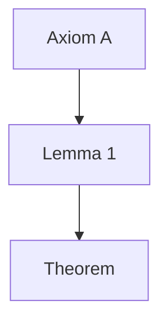

# Math Workflow

## Overview

The **Math Workflow** is a specialized system for rigorous mathematical research, proof development, and formal verification. It uses a three-agent system to plan research, execute proofs and calculations, and verify correctness with strict adherence to mathematical rigor.

## Agents

| Agent | Type | Model | Purpose |
|-------|------|-------|---------|
| **execute** | Executor | medium | Perform calculations, write proofs, implement formal code |
| **verify** | Executor | medium | Peer review proofs, check logic, verify formal code compilation |
| **advisor** | System Agent | heavy | Strategy, decomposition, synthesis, final approval |

### Roles and Responsibilities

**Executor Agents** focus on execution:
- `execute` — Perform calculations, write proofs, write and test formal code
- `verify` — Peer-review proofs, check logical correctness, verify formal code compiles

**System Agent** (highest priority):
- `advisor` — Plan research direction, decompose theorems into lemmas, synthesize results, approve final proofs
- **System Priority**: Advisor tasks always run first to ensure research direction is correct before execution

## Quick Start

### For Humans

1. **Define the goal**: Create a task for the advisor to decompose the theorem/problem
   ```bash
   bh create -t "Prove theorem X" -r advisor -p 1
   ```

2. **View the plan**: The advisor creates a DAG of subtasks (lemmas, proofs, verifications)
   ```bash
   bh tree  # See the proof strategy as a tree
   ```

3. **Execute and verify**: Run agents to prove lemmas and verify results
   ```bash
   bh worker --once  # Execute one proof or lemma
   ```

4. **Review results**: Check the final proof
   ```bash
   bh show <task-id>
   ```

### For Agents

1. **Advisor creates strategy**: Decompose the theorem into provable lemmas with dependencies
2. **Execute proves lemmas**: Implement proofs or calculations for assigned subtasks
3. **Verify checks work**: Peer-review proofs and formal code for correctness
4. **Escalate if needed**: If counterexample or flaw found, report back to advisor

## Key Concepts

### Task States

```
open → in_progress → closed
  ↓          ↓
deferred   failed
  ↓          ↓
awaiting_input  blocked
```

- **open**: Ready to work on
- **in_progress**: Currently being worked on
- **closed**: Completed successfully (proof verified, calculation done)
- **deferred**: Intentionally paused
- **failed**: Cannot be completed (counter-example found, flawed approach)
- **blocked**: Waiting on dependency lemmas
- **awaiting_input**: Needs clarification or strategy adjustment from advisor

### Task Priorities

Priority ranges from **0 (Critical)** to **4 (Backlog)**:

| Priority | When to Use |
|----------|-------------|
| 0 | Critical: Verification of main results, fixing fundamental flaws |
| 1 | High: Main theorem proof, core lemmas |
| 2 | Normal: Standard lemmas, calculations |
| 3 | Low: Polishing, alternative proofs |
| 4 | Backlog: Interesting conjectures not required for main goal |

**System Agent Priority**: Advisor tasks always run first, regardless of numeric priority.

### Task Dependencies (DAG)

Proofs are organized as a DAG of lemmas:

```
Main Theorem (advisor task)
├── Lemma 1 (execute)
│   ├── Sub-lemma 1.1 (execute) [depends on Lemma 1]
│   └── Sub-lemma 1.2 (verify) [depends on Lemma 1.1]
├── Lemma 2 (execute) [depends on Lemma 1]
└── Lemma 3 (execute) [depends on Lemmas 1 & 2]
```

A lemma can only be proven once its dependencies are verified.

### Immutable Definitions

**CRITICAL CONSTRAINT**: Executors must NEVER modify the theorem statement, definitions, or constraints provided by the advisor.

- If a theorem is **false**, **unprovable as stated**, or has **fundamentally flawed premises**, you MUST **escalate** to the advisor.
- Do not change the goal to make it easier to prove.
- Do not add convenient but unjustified axioms.
- If the advisor's strategy is wrong, escalate and explain why.

## Standard Handoff Patterns

### Advisor → Execute

When advisor decomposes a theorem:
- Create execute tasks for each lemma with explicit `--deps`
- Usually also pre-schedule verify tasks that depend on execute
- Example:
  ```bash
  # Advisor creates:
  bh create -t "Prove Lemma 3.1" -r execute -p 1 --deps <lemma-2-id>
  bh create -t "Verify proof of Lemma 3.1" -r verify -p 1 --deps <lemma-3.1-id>
  ```

### Execute → Verify

Usually pre-scheduled by advisor, but if execute finds an issue:
- Create verify task with `--deps` on the execute task
- Or report to advisor that approach is wrong

### Verify → Execute (Fixes)

When verify finds minor errors:
- Create execute task with `--inherit-deps` to fix the issue
- Example: `bh create -t "Fix sign error in Eq 3" -r execute -p 1 --inherit-deps <verify-id>`

### Escalation (Execute/Verify → Advisor)

When you find fundamental issues:
- **Counter-example found**: `bh create -t "Counter-example to Lemma X" -r advisor -p 0`
- **Flawed premise**: `bh create -t "Flaw in Lemma X approach" -r advisor -p 0`
- **Strategy wrong**: `bh create -t "Advisor review: Alternative strategy needed" -r advisor -p 1`
- **Cannot proceed**: `bh create -t "Escalation: Stuck on Lemma X" -r advisor -p 1`

## Output Format

### Natural Language / LaTeX (Glint-compatible markdown)

Use this format for mathematical proofs and explanations:

**Math Notation:**
- Inline: `$ E = mc^2 $`
- Display: `$$ \int_a^b f(x) dx $$`

**Diagrams (Mermaid):**


**Citations:**
- Inline reference: `[[#ref:id]]`
- Bibliography section: Add a `## References` section at bottom
- Format: `- [ref:id] "Title" Author (Year) URL`

**Links:**
- Wiki-style links to other documents: `[[Theorem Name]]`

**Example proof:**
```markdown
## Proof of Lemma 3.1

**Assumption**: We assume...

**Claim**: $$ \forall x \in \mathbb{R}, f(x) > 0 $$

**Proof**:
1. By definition of $f$, we have $f(x) = x^2 + 1$.
2. Since $x^2 \geq 0$ for all $x \in \mathbb{R}$, we have...
3. Therefore, $f(x) > 0$ for all $x \in \mathbb{R}$. QED

**Confidence**: Certain
```

### Formal Code (Lean, Coq, Isabelle, etc.)

Use formal code when requested by advisor:

**Requirements:**
- Code must **compile** without errors
- Self-contained or correctly imports dependencies
- Include assumption statements as comments
- Mark theorems/lemmas explicitly

**Example (Lean):**
```lean
theorem lemma_3_1 (x : ℝ) : x^2 + 1 > 0 := by
  have h1 : x^2 ≥ 0 := sq_nonneg x
  linarith
```

## Workflow Phases

### Phase 1: Strategy (Advisor)
- Advisor creates a task decomposing the main theorem into provable subtasks
- Each lemma or major step becomes a separate execute/verify task
- Dependencies are carefully planned to allow parallel work where possible

### Phase 2: Execution (Execute + Verify)
- Execute agent proves lemmas or performs calculations
- Verify agent checks each proof for correctness
- Executors escalate if they find issues or counter-examples
- Verifiers escalate if fundamental flaws are found

### Phase 3: Synthesis (Advisor)
- Once all lemmas are proven, advisor synthesizes the main result
- Reviews the overall proof structure for correctness and clarity
- Identifies any gaps or unstated assumptions

## Escalation Guide

| You Are | You Found | Action | Priority |
|---------|-----------|--------|----------|
| Execute | Logic gap you can't fill | Create `advisor` task: "Cannot prove Lemma X as stated" | 1 |
| Execute | Counter-example to theorem | Create `advisor` task: "Counter-example found" | 0 |
| Verify | Minor error (typo, sign) | Create `execute` task: "Fix sign error" | 2 |
| Verify | Major logical flaw | Create `advisor` task: "Reject: Flawed premise in Lemma X" | 0 |
| Execute | Advisor strategy is wrong | Create `advisor` task: "Strategy issue: Why we can't use this approach" | 1 |

## Commands Cheat Sheet

```bash
# Create tasks
bh create -t "Prove Lemma X" -r execute -p 1
bh create -t "Prove Lemma X" -r advisor -p 0 --deps <foundational-id>

# Chain proofs (Lemma B depends on Lemma A)
bh create -t "Prove Lemma B" -r execute -p 1 --deps <lemma-a-id>

# Schedule verification
bh create -t "Verify Lemma X" -r verify -p 1 --deps <execute-id>

# List and view
bh list                    # All open tasks
bh list --ready            # Only unblocked (ready to prove)
bh tree                    # View proof strategy as dependency tree
bh tree -b                 # Show what each lemma enables
bh show abc                # Task details

# Work on proofs
bh next                    # Get next lemma to prove
bh claim abc               # Mark as in_progress
bh close abc "Done"        # Mark proof as complete
bh worker --once           # Run one proof with AI agent
bh respond abc "answer"    # Answer advisor's question (needs_input)

# Manage dependencies
bh dep abc xyz             # Lemma ABC depends on Lemma XYZ
```

## Confidence Levels

When completing a proof, state your confidence:

| Level | When to Use | Example |
|-------|-------------|---------|
| **Certain** | Proof is rigorous, all steps justified | "Straightforward algebraic manipulation" |
| **High** | Very confident, only minor details uncertain | "Inductive step works; base case trivial" |
| **Moderate** | Proof works but has some subtle steps | "Convergence argument relies on compactness" |
| **Low** | Not confident; major gaps or unresolved issues | "Proof sketch but many details missing" |

Always explain *why* you have that confidence level in your task completion.

## Tips for Agents

1. **State assumptions clearly** at the beginning of each proof
2. **Use Advisor's definitions exactly** — don't modify problem statements
3. **Mark all references** to previous lemmas or theorems
4. **Escalate early** if you find a counter-example or fundamental issue
5. **Format code properly** if using formal verification languages
6. **Explain your confidence** in the proof's correctness
7. **Keep proofs self-contained** or clearly cite dependencies

## See Also

- **`_preamble.md`**: Detailed coordination protocols for math research
- **Individual agent files** (execute.md, verify.md, advisor.md): Agent-specific guidelines
- **CLAUDE.md** (project root): Architecture documentation
- **Glint server**: Renders markdown with KaTeX math notation
